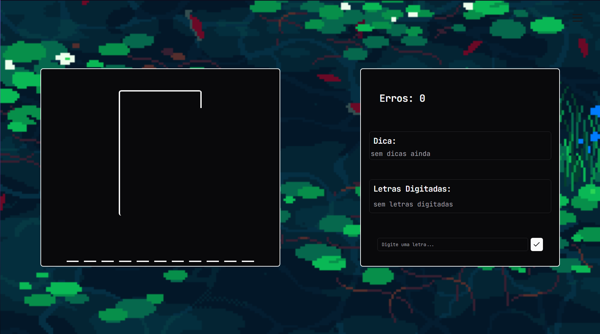

# Tacos

Este projeto é um jogo da forca desenvolvido utilizando Next.js, Tailwind CSS e TypeScript.

## Descrição
O objetivo do jogo é acertar uma palavra misteriosa com o menor número de tentativas possível. Além disso, oferece a opção de personalizar a experiência trocando a cor de fundo conforme preferência do jogador.

## Tecnologias Utilizadas
- [Next.js](https://nextjs.org/) - Um framework React para construção de aplicações web.
- [Tailwind CSS](https://tailwindcss.com/) - Um framework de utilitários CSS altamente configurável.
- [TypeScript](https://www.typescriptlang.org/) - Uma linguagem de programação que adiciona tipos à linguagem JavaScript.

## Como Jogar
1. Clone o repositório: `git clone https://github.com/seu-usuario/seu-projeto.git`
2. Instale as dependências: `npm install` ou `yarn install`
3. Inicie o aplicativo: `npm run dev` ou `yarn dev`
4. Acesse [http://localhost:3000](http://localhost:3000) no seu navegador.

Divirta-se jogando o Jogo da Forca e sinta-se à vontade para personalizar ainda mais o projeto conforme suas preferências!
